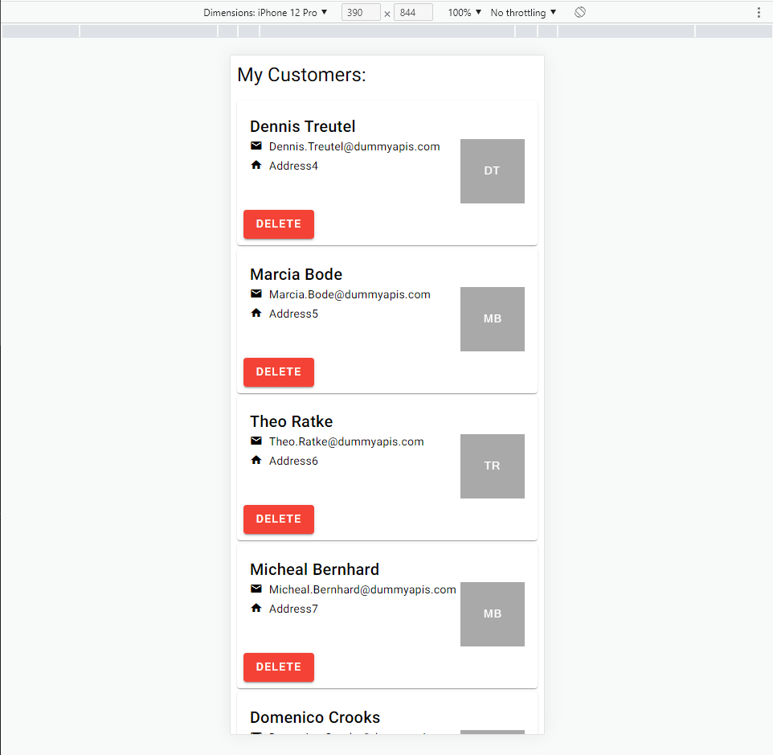

# JS_ANGULAR_standaloneComponents

A small example/tryout App for Standalone Components in Angular with a small service.
 

## Live Demo

https://ederlmarkus.github.io/JS_ANGULAR_standaloneComponents/
